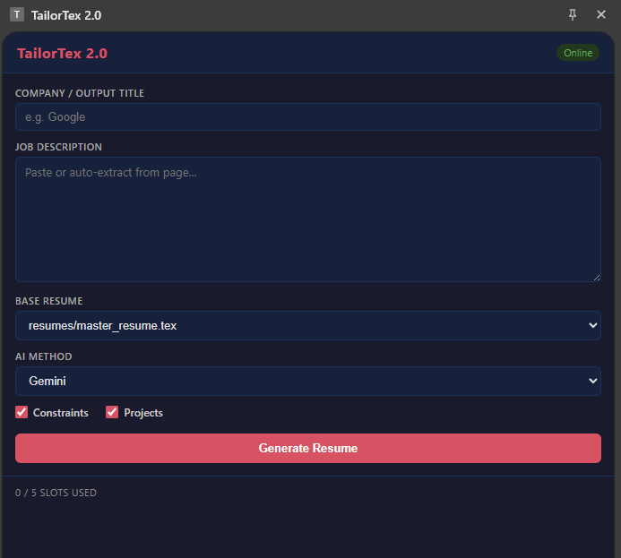

# TailorTex

Rewrites your LaTeX resume to match a job description — compiles to PDF via `pdflatex`.



## Features

- Rewrites bullet points and project descriptions to align with the job description
- Only touches whitelisted sections — never breaks LaTeX structure, company names, or job titles
- One-page output guaranteed
- Compiles `.tex` → `.pdf` automatically and opens it
- Multi-job queue with parallel Gemini + Claude runs
- Location selector — choose the city/state shown in the resume header per job submission; extensible via a single list in the backend
- Output browser — browse all saved resumes on disk with Open PDF, View Details, Recompile, and Delete actions
- Two modes: Chrome extension (recommended) or CLI

## Requirements

- Python 3.x — `pip install -r requirements.txt`
- `pdflatex` on PATH — [MiKTeX](https://miktex.org/) (Windows) or TeX Live (Mac/Linux)
- `.env` file in the project root:
  ```env
  GEMINI_API_KEY=your_api_key_here
  BACKUP_LOCATION=C:\Path\To\Your\Backup\Folder
  ```

---

## Extension + Backend Setup

### 1. Start the backend

```bash
cd backend
uvicorn api.server:app --port 8001 --reload
```

### 2. Load the extension

1. Go to `chrome://extensions`
2. Enable **Developer mode**
3. **Load unpacked** → select `frontend/extension/`
4. Click the extension icon — it opens as a side panel

The extension submits jobs to the backend, streams logs in real time, and opens the PDF when done. Up to 5 jobs can be queued at once.

### Generation methods

| Method | What it uses |
|--------|-------------|
| `gemini` | Gemini API (requires `GEMINI_API_KEY`) |
| `claudecli` | Local Claude Code CLI (`claude` must be on PATH) |

---

## CLI Setup

For local/CLI usage without the extension, see [`local/README.md`](local/README.md).

---

## Resumes (`resumes/`)

Put your `.tex` resume files here. Any filename works — the extension lists all `.tex` files in this directory as selectable options.

Example: `resumes/master_resume.tex`

The `examples/resumes/` directory has a sample template to start from.

---

## Prompts (`prompts/`)

Three files, all optional but expected:

| File | Purpose |
|------|---------|
| `system_prompt.txt` | Core AI rules — defines which LaTeX sections can be edited. Update this if you change your resume's structure. |
| `user_constraints.txt` | Per-run hard rules (e.g., "don't change X job title"). Leave empty to skip. |
| `additional_projects.txt` | A bank of extra projects the AI can swap in if they fit the JD better. Leave empty to skip. |

The `examples/prompts/` directory has working examples of each.
